# Ejercicio de Git - Proyecto labowebs

> Proyecto realizado por Alejandro Luis Rey


[TOC]

## Trabajo en local

> Trabajo individual en tu ordenador - Esta parte se resuelve con comandos. Tu solución debe incluir el enunciado de cada cuestión, un bloque de código con los  comandos GIT utilizados y captura/s de pantalla donde se vea la ejecución de los  comandos y su salida.

### Cuestiones

1. Inicializa un nuevo repositorio Git en una carpeta llamada  `"labowebs"` y agrega los  archivos proporcionados en el aula virtual. Renombra la rama master a  `main`, si es  necesario. Realiza el primer commit. Muestra el log del repositorio.

   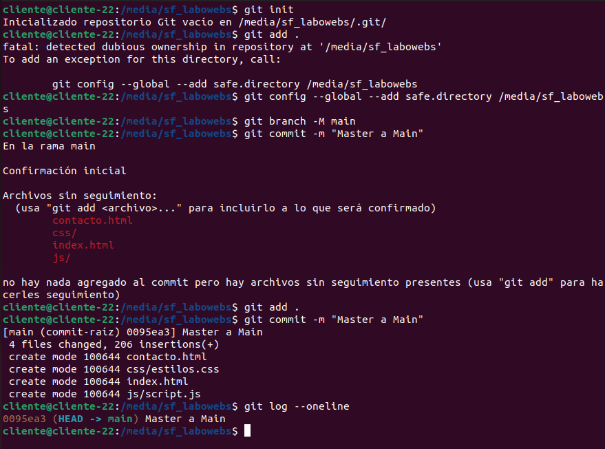

   ```bash
   git init
   git config --global --add --safe.directory /media/sf_labowebs
   git add .
   git branch -M main
   git commit -m "Master a Main"
   git log --oneline
   ```

   

2. Incluye un fichero  `.gitignore` para que  los ficheros  `README.md`,  `LICENCE.txt` y  `passwords.txt` sean ignorados por el control de versiones. Realiza el commit y muestra  los logs del repositorio en una línea.

   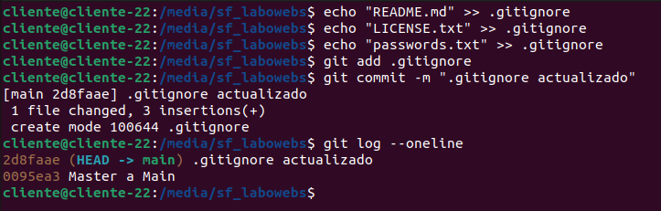

   ```bash
   echo "README.md" >>.gitignore
   echo "LICENSE.txt" >>.gitignore
   echo "passwords.txt" >>.gitignore
   git add .gitignore
   git commit -m ".gitignore actualizado"
   git log --oneline
   ```

   

3. En el repositorio, crea los archivos   `README.md`,  `LICENCE.txt` y  `passwords.txt` con  algún contenido. Muestra el estado del repositorio. Muestra el listado de archivos  ignorados.

   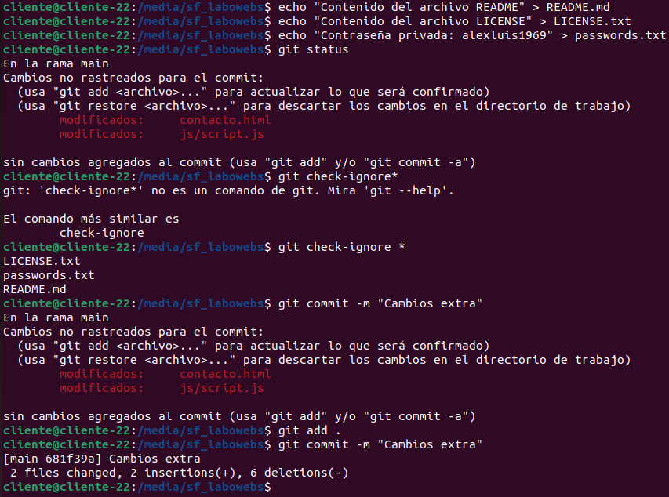

   ```bash
   echo "Contenido del archivo README" > README.md
   echo "Contenido del archivo LICENSE" > LICENSE.txt
   echo "Contraseña privada: alexluis1969" > passwords.txt
   git status
   git check-ignore *
   git add .
   git commit -m "Cambios extra"
   ```

   

4. Crea una rama  `feature-estilos`. Cámbiate a ella. 

   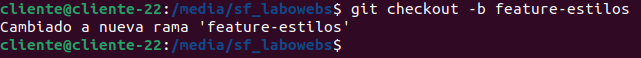

   ```bash
   git checkout -b feature-estilos
   ```

   - Modifica el archivo  `estilos.css`: 
     - propiedad color del  `body` y de `h2: #2a2a2a`
     
       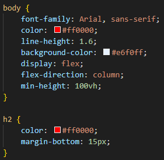
     
     - propiedad `background-color` de `header` y `footer: #2a75ff`
     
       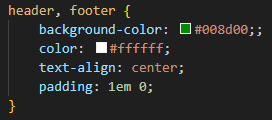
     
     - Comprueba el estado del repositorio. Añade los cambios, realiza un commit con el  mensaje "actualizados estilos a azules"
     
       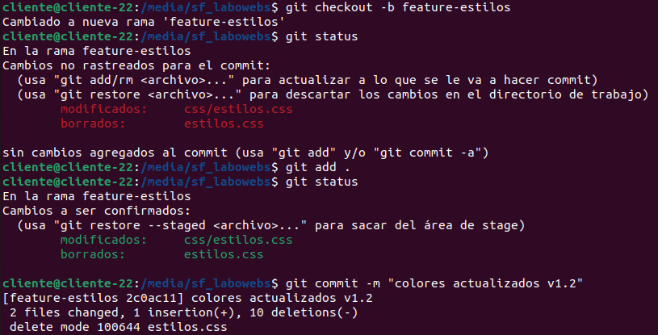
     
       ```bash
       git status
       git add .
       git status
       git commit -m "colores actualizados v1.2"
       ```
     
       

5. Vuelve a la rama  `main`. En el archivo  `index.html` añade un comentario donde se indique  tu nombre como autor de la página. Comprueba el estado del repositorio. Añade los  cambios, realiza un commit con el mensaje ' añadido autor en index'. Muestra los logs del  repositorio en una línea, gráficamente y con 'decoración'

   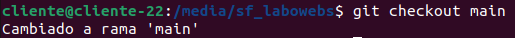

   ```bash
   git checkout main
   ```

   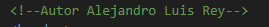

   ```bash
   <!-- Autor Alejandro Luis Rey -->
   ```

   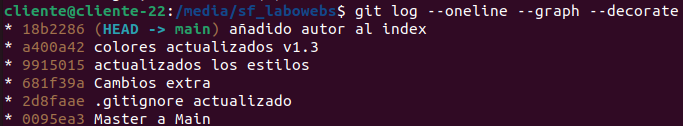

   ```bash
   git log --oneline --graph --decorate
   ```

   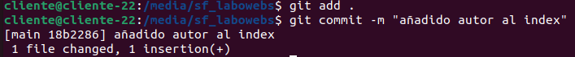

   ```bash
   git add .
   git commit -m "añadido autor al index"
   ```

   

6. Fusiona la rama  `feature-estilos` en la rama  `main`. Muestra los logs del repositorio en  una línea, gráficamente y con 'decoración'

   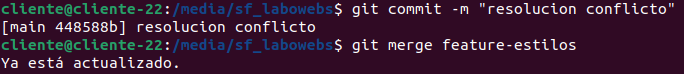

   ```bash
   git commit -m "resolucion conflicto"
   git merge feature-estilos
   ```


## 

## Trabajo en remoto

> Esta parte se realizará con la herramienta gráfica  `Sourcetree` y con  `GitHub`. Para cada cuestión, incluye el enunciado y las capturas de pantalla donde se muestre la  solución. Si es necesario, incluye alguna explicación  

### Cuestiones

1. Continúa con el repositorio  `labowebs`.  Añade el repositorio a Sourcetree.

   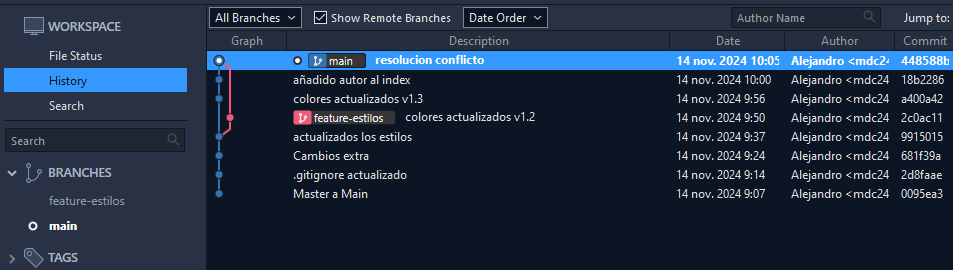

2. Crea un repositorio remoto y sube al remoto los ficheros de tu repositorio local. Debes  subir todas las ramas.

   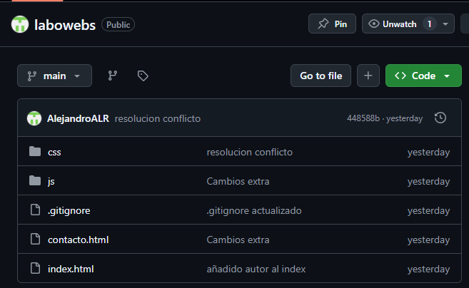

3. Crea una rama  `feature-index`.  Añade el siguiente código dentro de la <section class="about">. Añade los cambios y crea un commit. Sube los cambios al remoto.

   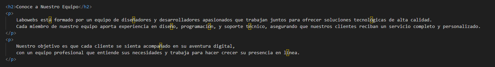

   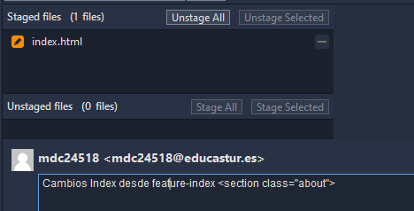

   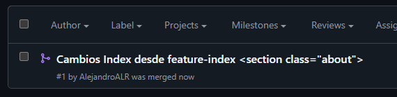

4. En el repositorio local, fusiona la rama  `feature-index` en la rama  `main`.

   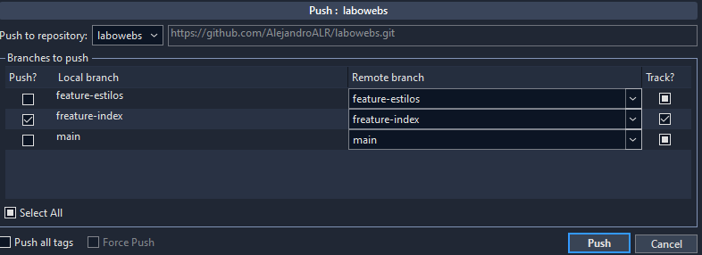

5. Edita el fichero  `contacto.html`. Borra unas líneas. Muestra los ficheros con cambios  pendientes y las diferencias. Añade los cambios y haz un commit.

   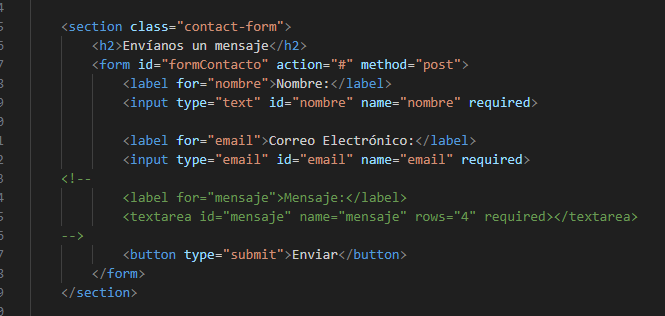

   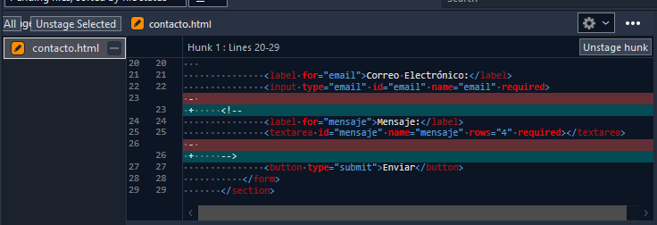

   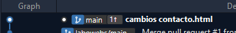

6. Te das cuenta del error. Deshaz el commit anterior. Captura el estado actual del  repositorio.

   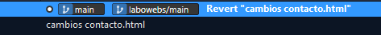

   ​	Antes

   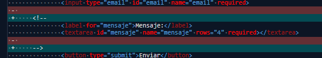

   ​	Después:

   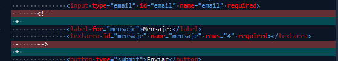

7. Crea una rama  `feature-mapa` . Incluye este código en el archivo  `contacto.html`. Añade  los cambios. Realiza un commit. Sube los cambios al remoto. Muestra en el remoto los  cambios del archivo  `contacto.html` en la rama  `feature-mapa`.

   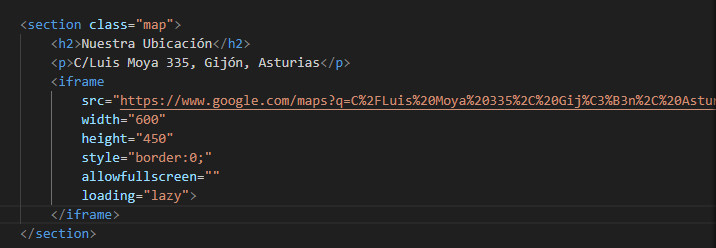

   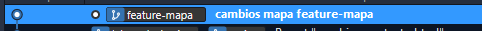

   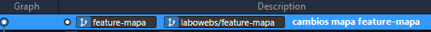

   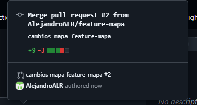

8. En GitHub,  en la rama  `main`, fusiona la rama  `feature-mapa`. Baja los cambios del remoto  a local. Deja los dos repositorios sincronizados.

   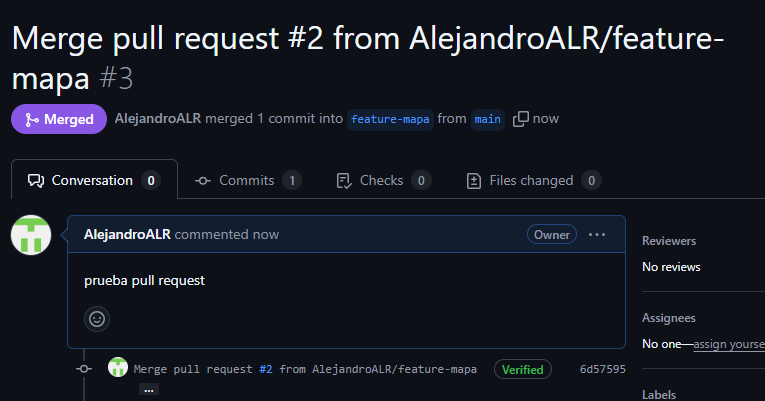

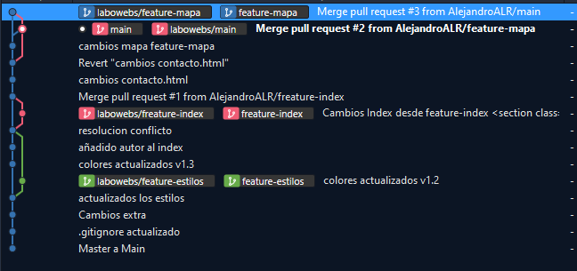

## Conflictos

### Cuestiones

1. Crea una rama  `hotfix-js`. Cámbiate a ella. Añade este código en el fichero `script.js`.  Confirma el cambio y haz un commit.  (Fíjate en los números de línea...)

   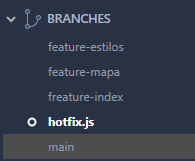

   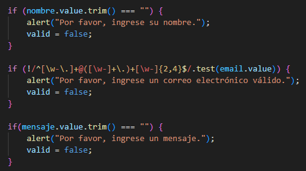

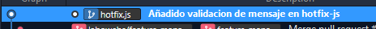

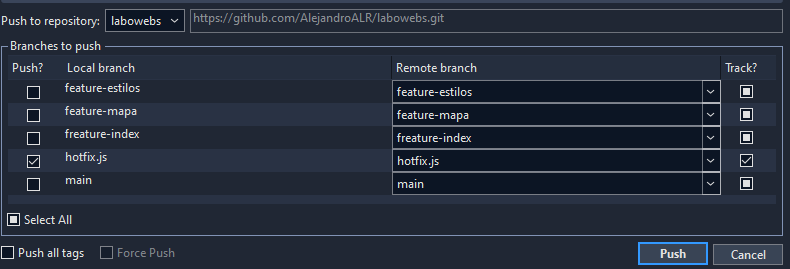

2. Vuelve a la rama `main`. En el fichero `script.js` en las mismas líneas que en la cuestión anterior, añade el código siguiente. Confirma el cambio y haz un commit.

   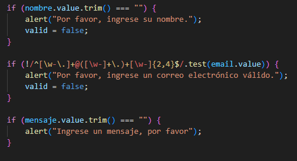

   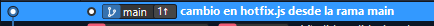

3. Fusiona la rama  `hotfix-js` en  `main`. Debe producirse un conflicto. Resuélvelo. Cuando  termines la resolución del conflicto sube los cambios al remoto - Deja los repositorios  sincronizados

   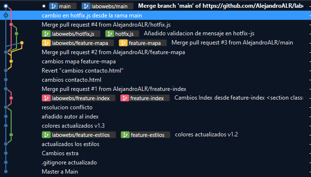
   
   ## Subida de documentación
   
   En la carpeta del proyecto  `labowebs` añade una carpeta  `docs`. Copia en esa carpeta el  fichero markdown y la carpeta con las imágenes. Incluye también el `pdf`. Añade todo al repositorio. Súbelo al remoto.
   
   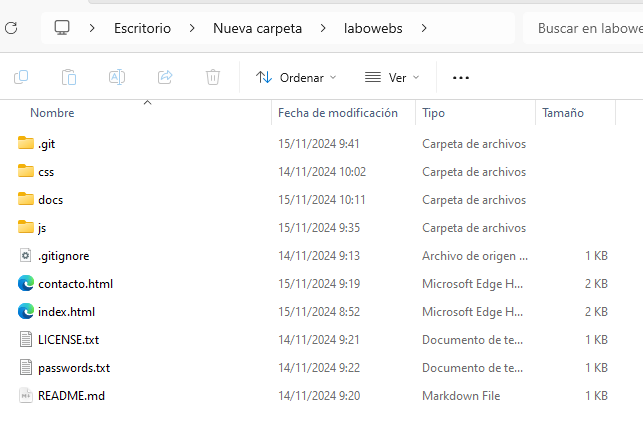
   
   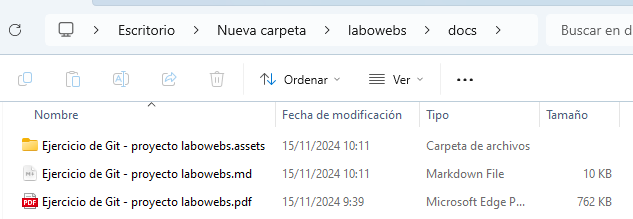
   
   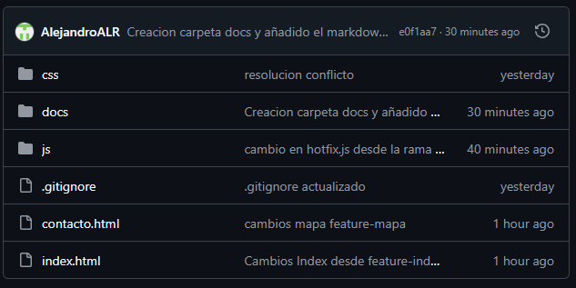
   
   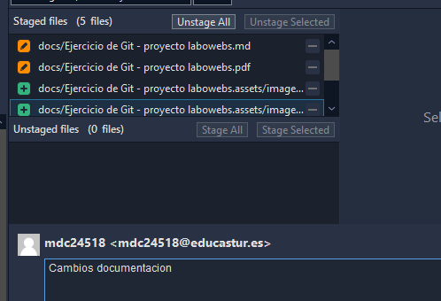
   
   
   
   
